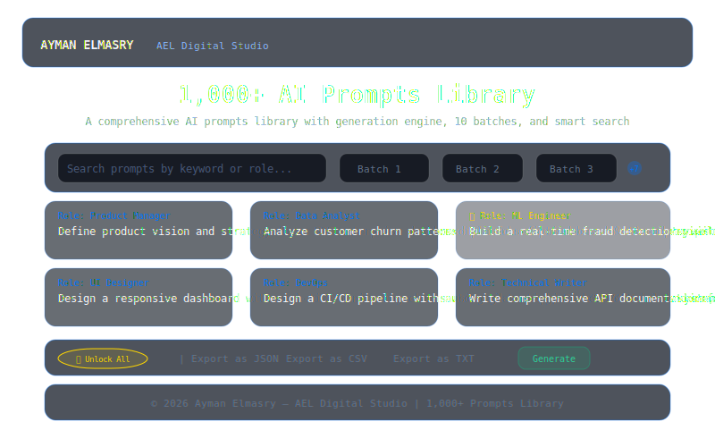

# AEL | 1,000+ AI Prompts Library

> **1,000+ professional AI prompts** across 10 curated batches and 20+ professional roles.  
> Featuring a built-in generation engine, smart search, Ultra-Lock System™, and multi-format export.  
> Built by Ayman Elmasry — AEL Digital Studio.

---

## Preview



---

## Table of Contents

- [Features](#features)
- [How It Works](#how-it-works)
- [Project Structure](#project-structure)
- [Getting Started](#getting-started)
- [Usage](#usage)
- [Export Formats](#export-formats)
- [Technical Details](#technical-details)
- [Credits](#credits)

---

## Features

- **1,000+ prompts** — 10 batches × 100 prompts each across 20+ professional roles
- **Generation Engine** — AEL Prompt Generation Engine for dynamic prompt creation
- **Smart search** — real-time filtering by keyword, role, or scenario
- **10 batches** — curated, sequential batches for organized browsing
- **3 export formats** — JSON, CSV, TXT — export the entire library
- **Ultra-Lock System™** — premium-locked prompts with gold lock indicators
- **One-click copy** — copy any prompt to clipboard instantly
- **Role-based organization** — Product Managers, Data Analysts, UI Designers, DevOps, ML Engineers, and more
- **Glassmorphism UI** — dark theme with blue (#0074FF) accents

---

## How It Works

### Prompt Architecture

The library organizes 1,000+ prompts across 10 curated batches. Each batch focuses on a specific professional domain or use case. Prompts are stored as structured objects with role, category, and full text fields.

| Field | Description | Example |
|-------|-------------|---------|
| `id` | Unique identifier | `batch-01-001` |
| `role` | Professional role | `Product Manager` |
| `category` | Category label | `Strategy` |
| `text` | Full prompt text | `As a Product Manager, define a roadmap for...` |
| `locked` | Ultra-Lock status | `true` / `false` |

### Search Engine

- Real-time filtering as the user types
- Matches against role, category, and prompt text (case-insensitive)
- Instant results with zero latency

### Generation Engine

The built-in generation engine dynamically creates new prompts by combining role templates with professional context:
1. Select a role from 20+ options
2. The engine generates a contextually relevant prompt
3. Copy, save, or export the result

---

## Project Structure

```
ael-1000-prompts-library/
├── index.html                     # HTML5 semantic structure
├── css/
│   └── style.css                  # All styles (glassmorphism, dark theme)
├── js/
│   └── script.js                  # Full JS engine (prompts, search, generation, export)
├── screenshot.svg                 # Project preview image
├── .gitignore
└── README.md
```

This separation follows modern web best practices:
- **HTML5** — semantic elements
- **CSS3** — custom properties for theming, Flexbox/Grid layout
- **Vanilla JS (ES2020+)** — zero dependencies, runs in any modern browser

---

## Getting Started

### Run Locally

```bash
git clone https://github.com/aymanelmasryael/ael-1000-prompts-library.git
cd ael-1000-prompts-library
open index.html
```

Or simply open `index.html` in any modern browser — no server required.

### Prerequisites

- A modern web browser (Chrome, Firefox, Safari, Edge)
- No build tools, no package managers, no server

---

## Usage

### Browse Prompts
- Open `index.html` — 10 batches load automatically
- Navigate between batches using the batch selector

### Search
- Type in the search box to filter across all 1,000+ prompts
- Matches against role, category, and prompt text

### Generate Prompts
- Use the **Generation Engine** to create new prompts dynamically
- Select a professional role and click generate

### Copy a Prompt
- Click any prompt card to copy its text to clipboard instantly

### Export
- Use the export buttons to download the full or filtered dataset

---

## Export Formats

| Button | Format | Filename |
|--------|--------|----------|
| JSON | JSON array | `ael_1000_prompts.json` |
| CSV | RFC 4180 CSV | `ael_1000_prompts.csv` |
| TXT | Numbered text | `ael_1000_prompts.txt` |

---

## Technical Details

| Aspect | Detail |
|--------|--------|
| Architecture | Static site (HTML5 + CSS3 + JS) |
| JavaScript | Vanilla ES2020+, zero dependencies |
| CSS | Custom properties for theming |
| Data storage | In-memory prompt dataset |
| Browser support | Chrome, Firefox, Safari, Edge (modern versions) |
| Offline | Works locally via `file://` |

---

## Credits

**Created by:** Ayman Elmasry — AEL Digital Studio  
**Website:** [aymanelmasry.com](https://aymanelmasry.com)  
**Email:** [info@aymanelmasry.com](mailto:info@aymanelmasry.com)  
**License:** © 2026 Ayman Elmasry — AEL Digital Studio. All rights reserved.

### Connect

[LinkedIn](https://linkedin.com/in/aymanelmasryael) · [Instagram](https://instagram.com/aymanelmasryael) · [X](https://x.com/aymanelmasryael) · [CodePen](https://codepen.io/aymanelmasryael) · [GitHub](https://github.com/aymanelmasryael) · [Behance](https://behance.net/aymanelmasryael)

---

*AEL Prompt IP System v1.0 — Sovereign Identity Block*
